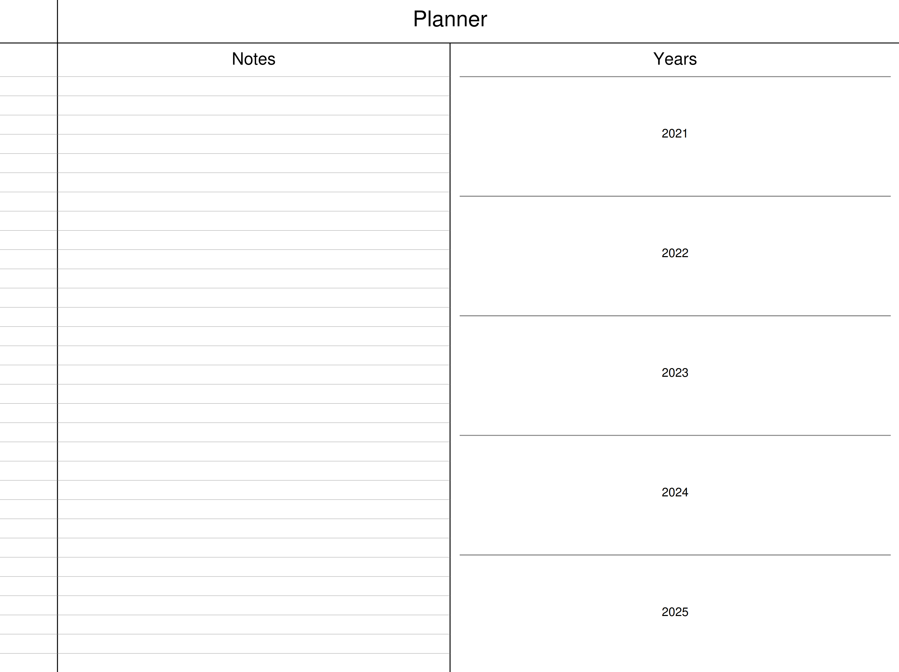
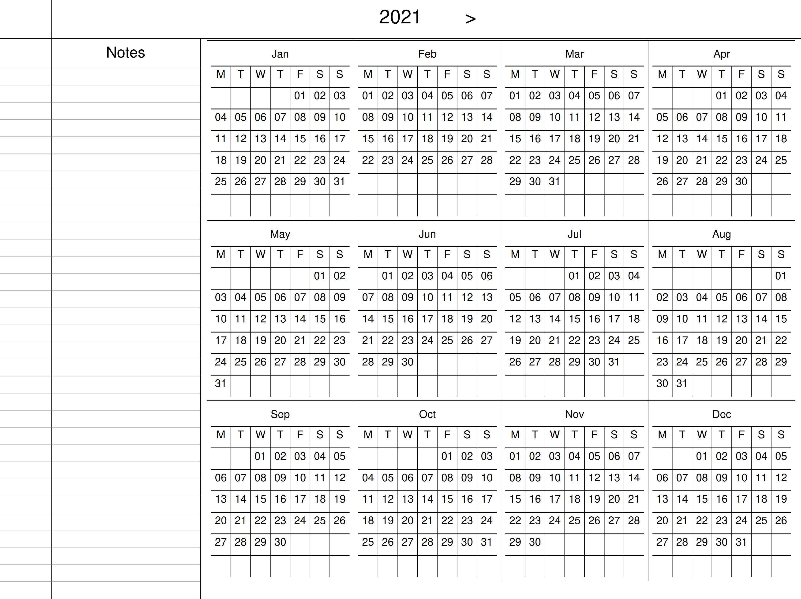
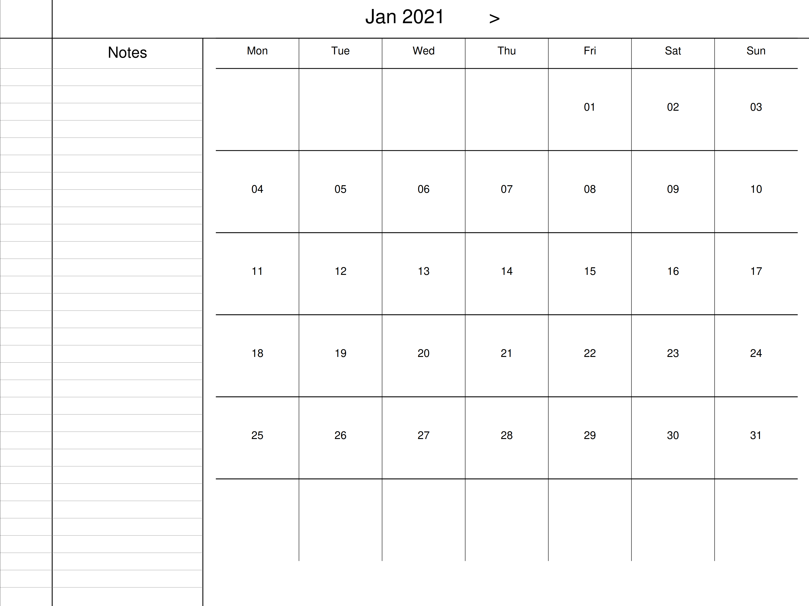
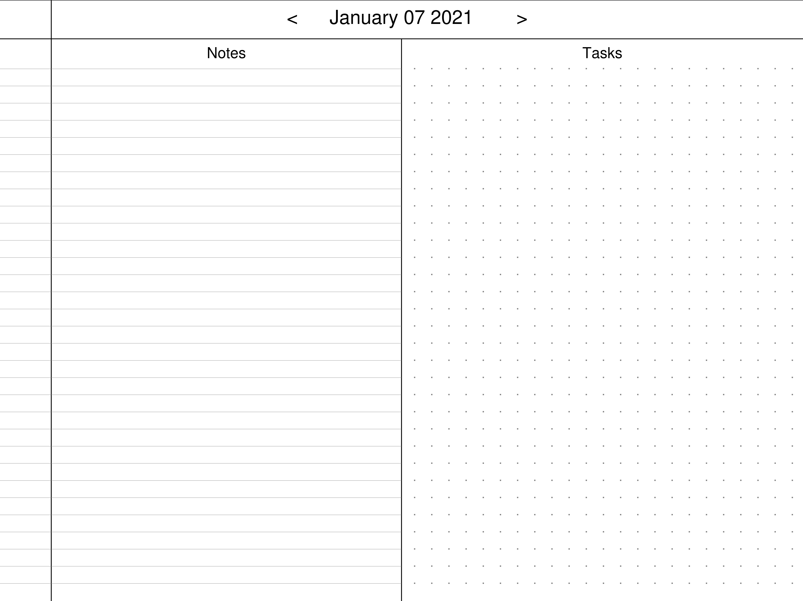
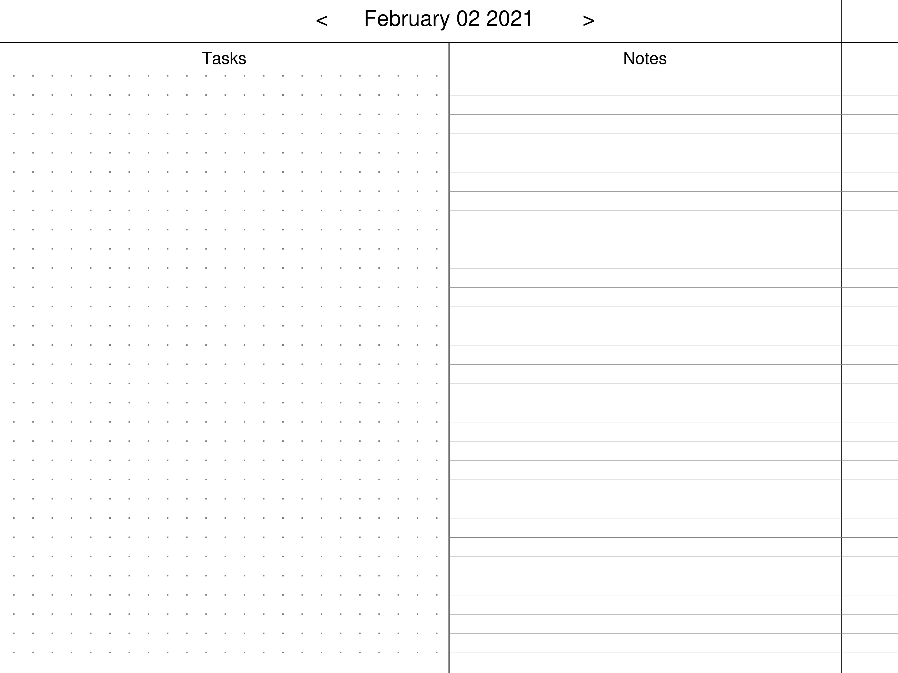

# Planner PDF
This will generate a PDF File that can be used as a planner on the remarkable platform. 
It uses the libharu library to generate the PDF and the Date library to perform calendar math.

# Screenshots

The Front index page. Click on the year to go that year's page.

The view of all the months and days in a year. The month name is clickable to go a month view and the dates are clickable to go to that day.
Click on the page title to go back to the main view. Click on the arrow next to the title to go to the next year.

The month view, click on a date to go that day's page. Click on the title to go back to the year view and use the arrows to go to previous and next months.

The day view. Click on the title to go back to the month view. Use the arrows to navigate to the next and previous page. The next/previous page swipe also works to navigate pages however when swiping next from the last day of a month it will show the next months page.

The day view in the left handed version of this document.

# Available Samples
8 different sample files are available in the samples directory incase you do not wish to compile and generate the file yourself.
Each sample file has an original file and compressed version which is smaller in size but maintains most of the fidelity of the original.
The different files are labeled according to their differences.

Below is a summary of a few of the files.

                        FILE NAME                         |                  DESCRIPTION
    ______________________________________________________|_____________________________________________________________________________________________
    calendar_2021_1year_Monday_start_left_handed_v1_0.pdf | Start year is 2021. It is a one year planner with days starting on Monday and is left handed
    calendar_2021_5year_Monday_start_left_handed_v1_0.pdf | Start year is 2021. It is a five year planner with days starting on Monday and is left handed
    calendar_2021_5year_Sunday_start_right_handed_v1_0.pdf| Start year is 2021. It is a five year planner with days starting on Sunday and is right handed

# How to compile
Make sure you have libharu development library installed. Either compiled from source or from your package manager.

    sudo apt-get install libhpdf-dev

The libharu github page is at:

  https://github.com/libharu/libharu

The date library is part of this repository. It has its own license and is obtained from:

  https://github.com/HowardHinnant/date

# Compilation
Clone the repository then create a build directory and run cmake followed by make. The below is the default usage.

    git clone https://github.com/revelationnow/PlannerPDF.git
    cd PlannerPDF
    mkdir build
    cd build
    cmake ..
    make create

The `make create` command will generate a file called planner.pdf in the build directory which can be used as is. The file size can be large depending for the default settings. The following cmake options are available to modify:

    Option                                 | Default Value       | Comment
    _______________________________________|_____________________|_______________________________________________________________
    PDF_FILENAME                           | planner             | The filename used for the generated pdf (no extension)
    START_YEAR                             | 2021                | The starting year for the planner
    NUM_YEARS                              | 5                   | The number of years in the planner. Reduce this to reduce size
    COMPRESSED_FILE                        | planner_compressed  | The filename of a compressed version of the file
    Planner_PDF_Start_Day                  | 0                   | This allows moving the start day of the month view to a day other than Sunday
                                           |                     | 0 : Sun, 1 : Mon, 2 : Tue, 3 : Wed, 4 : Thu, 5 : Fri, 6 : Sat

There is a make target called `make compress` which will us ghostscript to try to reduce the filesize. For the 5 year planner it can bring the size down from ~43mb to ~19mb.

Below is an example of invoking the build with additional options. This will set the dedault output filename to calendar.pdf set the start year to 2020 set the number of yeaers in the planner to 1 year, name the compressed version of the file calendar_small.pdf and set the start day of the week in the month view to Monday

    git clone https://github.com/revelationnow/PlannerPDF.git
    cd PlannerPDF
    mkdir build
    cd build
    cmake -DNUM_YEARS=1 -DPDF_FILENAME=calendar -DSTART_YEAR=2020 -DCOMPRESSED_FILE=calendar_small -DPlanner_PDF_Start_Day=1 ..
    make compress

There is additionally a make target to update the samples in the samples directory. To invoke that, use `make update_samples` for the default file and `make update_compressed_samples` for the compressed file. When naming the samples file, it will append x_year in the file name.

# Usage
To use the PDF copy it to the remarkable device.  
The navigation from child page to parent page is done by clicking on the title page. 
Clicking on the left or right arrows will allow navigation to previous and next pages for days, months or years.

